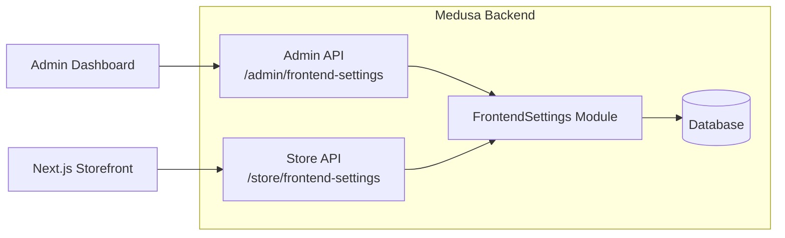

# Frontend Settings Toggle API

## Architecture



## 1. Create FrontendSettings Module

Create `src/modules/frontend-settings/` with:

**Data Model** (`models/frontend-settings.ts`):

```typescript
const FrontendSettings = model.define("frontend_settings", {
  id: model.id().primaryKey(),
  waitlist_enabled: model.boolean().default(false),
  passcode: model.text().nullable(), // null = no passcode required
})
```

**Service** (`service.ts`): Extend `MedusaService` for CRUD operations.

**Module Definition** (`index.ts`): Export module with `FRONTEND_SETTINGS_MODULE` constant.

## 2. Create Admin API Routes

**`src/api/admin/frontend-settings/route.ts`**:

- `GET`: Retrieve current settings
- `POST`: Update settings (waitlist_enabled, passcode)

Routes under `/admin/` are automatically protected for admin users.

## 3. Create Store API Route

**`src/api/store/frontend-settings/route.ts`**:

- `GET`: Public endpoint for storefront to fetch current settings

## 4. Register Module

Add the module to `medusa-config.ts` and run migrations.

## Files to Create/Modify

| File | Action |

|------|--------|

| `src/modules/frontend-settings/models/frontend-settings.ts` | Create |

| `src/modules/frontend-settings/service.ts` | Create |

| `src/modules/frontend-settings/index.ts` | Create |

| `src/api/admin/frontend-settings/route.ts` | Create |

| `src/api/store/frontend-settings/route.ts` | Create |

| `medusa-config.ts` | Modify |
